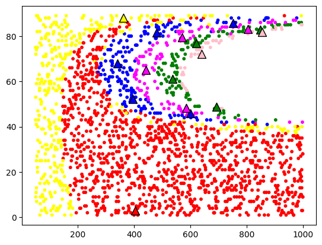

# Effect-driven Motion Space Discretization

[](https://www.python.org/downloads/release/python-3810/)

This package provides the implementation of the effect-centric motion/action space discretization approach presented in the paper [*Unsupervised Learning of Effective Actions in Robotics*][paper]. It can be used with any continuous motion/action space and will generate discrete action prototypes each producing different effects in the environment. After an exploration phase, the algorithm automatically builds a representation of the effects and groups motions into action prototypes, where motions more likely to produce an effect are represented more than those that lead to negligible changes.

## Installation

To use this package you can simply use pip to directly install this package:

`pip install git+https://github.com/marko-zaric/action-prototype-gen.git`

## Usage

In order to demostrate how to use this package the Git repository comes with some sample data stored in the csv-file `data/motion_samples.csv`. These motion samples have been generated in the [*Up The Stairs*][up-the-stairs]  environment. First you have to load the data into a Pandas Dataframe:

```python
import pandas as pd

df_data = pd.read_csv("data/motion_samples.csv")
df_data = df_data[df_data['robot_in_map'] == True] # exclude faulty samples
df_data = df_data.sample(n=2000,random_state=42) # limit to 2000 samples by random subsampling
```

Next you have to list the motion dimensions of your continuous motion space as they appear as column names in your Dataframe. Additionally you have to specify the effects based on which you want to cluster. Effect dimensions is a list of lists so that effects can be bundled according to their physical units for correct normalization (for example: spartial translational effects (distance) are one bundle, spartial rotational changes (angles) are a different one)

```python
effect_dims = [['dy', 'dz']]
motion_dims = ['magnitude', 'angle']
```

Lastly import the Prototype Generator and create the discrete action prototypes:

```python
from actprogen import effect_based_prototypes
prototype_generator = effect_based_prototypes.EffectActionPrototypes(df_data, motion_dims)
prototypes = prototype_generator.generate(effect_dimensions=effect_dims)
```

To vizualize the result for this specific example you can use this script:

```python
import matplotlib.pyplot as plt 

colors = ['red', 'green', 'blue', 'magenta', 'yellow', 'pink', 'cyan']

def color_picker(x):
    return colors[x]

plt.scatter(df_data.magnitude, df_data.angle, c=list(map(color_picker,prototype_generator.m_samples_labeled['cluster_label'])), s=10)

for i, label in enumerate(set(prototype_generator.m_samples_labeled['cluster_label'])):
    local_ap = prototype_generator.prototypes_per_label[label]      
    plt.scatter(local_ap.T[0], local_ap.T[1], marker="^", s=100, color=colors[i], edgecolors='black')
plt.show()
```

The resulting clusters and action prototypes are visualized in the following image:

 <p float="left">
  <figure>
        
    </figure> 
</p>

For more detailed information on the method please checkout our paper [*Unsupervised Learning of Effective Actions in Robotics*][paper].

## License
This project is licensed under a Creative Commons Attribution 4.0 International License - see the [LICENSE](LICENSE) file for details.

## Acknowledgements
This research was funded in whole or in part by the Austrian Science Fund (FWF) [ELSA, DOI: 10.55776/I5755]. For open access purposes, the author has applied a CC BY public copyright license to any author accepted manuscript version arising from this submission.


[paper]: <https://arxiv.org/abs/2404.02728>
[up-the-stairs]: <https://github.com/marko-zaric/up-the-stairs.git>
